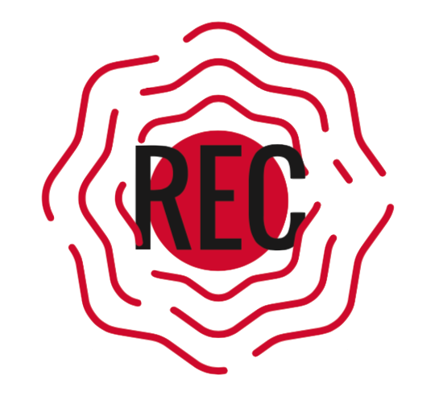

<html lang="es">
<head>
  <meta charset="UTF-8">
  <meta name="viewport" content="width=device-width, initial-scale=1">
  <title>Fundación Manacus</title>
  
</head>
<body>
  <header class="header-manacus">
    

      

        
      

      <nav class="header-nav">
        <a href="services/">Servicios</a>
        <a href="projects/">Proyectos</a>
        <a href="tecnologia/">Tecnología</a>
        <a href="quienes/">¿Quiénes somos?</a>
        <a href="contacto/">Contacto</a>
      </nav>
    

  </header>
  <!-- CONTENIDO PRINCIPAL SIGUIENTE -->
  

    

      
    

    
Promovemos la preservación y protección del medio ambiente, desde una perspectiva territorial y de derechos, reconociendo la diversidad cultural y social e impulsando la implementación de nuevas tecnologías para el monitoreo, conservación y gestión sostenible de la biodiversidad.

      
    Consulta la documentación de la fundación en el siguiente
    <a href="https://drive.google.com/drive/folders/1CbhU2uk9KZeAq2XAYW3GV9nvNxB_VJUJ?usp=drive_link">ENLACE</a>
     
    Queremos conocer tu opinión, deja tus comentarios
    <a href="https://forms.gle/BLGUCDMGW3Qd51Xg9">AQUÍ</a>
     
    <!-- SELECT YOUR SERVICE (cards) -->
    <h2>Servicios</h2>
    <section class="services-section">
      

        

          
📡

          <h3>Monitoreo acústico</h3>
          
Instalación de estaciones y procesamiento automático de detecciones.

        

        

          
📊

          <h3>Análisis de datos</h3>
          
Modelos y dashboards para interpretación y toma de decisiones.

        

        

          
🤝

          <h3>Capacitación</h3>
          
Talleres y formación para comunidades y técnicos locales.

        

        

          
📡

          <h3>Desarrollo de tecnología</h3>
          
Diseño y desarrollo de soluciones a medida: sensores, firmware y plataformas para análisis acústico.

        

      

    </section>
    <h2>Estamos comprometidos con:</h2>
        <ul>
          <li><strong style="color:#19306c;">Preservar</strong> la biodiversidad mediante el uso de tecnologías avanzadas.</li>
          <li><strong style="color:#19306c;">Fortalecer</strong> la toma de decisiones con datos acústicos precisos y análisis automatizados.</li>
          <li><strong style="color:#19306c;">Empoderar</strong> a comunidades, instituciones y empresas con capacidades técnicas en bioacústica.</li>
          <li><strong style="color:#19306c;">Innovar</strong> en metodologías de monitoreo para la conservación basada en evidencia.</li>
        </ul>
    <h2>Contamos con</h2>
      <ul>
        <li><strong style="color:#19306c;">Expertos</strong> en ecoacústica con experiencia en múltiples ecosistemas.</li>
        <li><strong style="color:#19306c;">Tecnología</strong> de punta para análisis eficiente de grandes volúmenes de datos.</li>
        <li><strong style="color:#19306c;">Enfoque interdisciplinario</strong> (ecología, acústica, ciencia de datos).</li>
        <li><strong style="color:#19306c;">Compromiso</strong> con la conservación y las comunidades locales.</li>
        <li><b style="color:#19306c;">Aliados estratégicos</b> 
            Biodiversity Analytics S.A.S. 
            Instituto Humboldt</li>
      </ul>   
      
Parte de la Red Ecoacústica Colombiana
        

  

  <footer style="width:100%;background:#f8fafd;color:#19306c;text-align:center;padding:1.2em 0;font-size:1.08em;margin-top:2em;box-shadow:0 -1px 8px #19306c22;">
  contacto@manacus.co | Cali, Valle del Cauca, Colombia | © 2025 Manacus | NIT: 9 0 1 9 5 6 7 5 3
  </footer>
</body>
</html>

  

