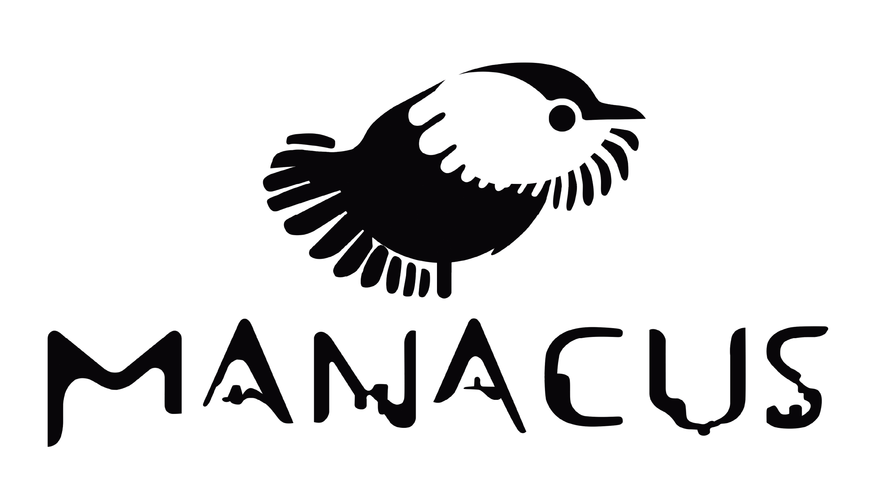

<html lang="es">
<head>
  <meta charset="UTF-8">
  <meta name="viewport" content="width=device-width, initial-scale=1">
  <title>Fundación Manacus</title>
  <link href="https://fonts.googleapis.com/css2?family=Inter:wght@400;700&display=swap" rel="stylesheet">
  
</head>
<body>
  

    <header class="header-manacus">
      

        <nav style="display:flex;gap:1em;flex-wrap:wrap;">
          <a href="services/">Servicios</a>
          <a href="projects/">Proyectos</a>
          <a href="tecnologia/">Tecnología</a>
          <a href="quienes/">¿Quiénes somos?</a>
          <a href="contacto/">Contacto</a>
        </nav>
      

    </header>
  

  

    

      
    

    <h2>NUESTRO OBJETIVO</h2>
    <strong>Promover la preservación y protección del medio ambiente, desde una perspectiva territorial y de derechos, que reconozca la diversidad cultural y social para el ordenamiento, uso y manejo adecuado de los recursos naturales renovables y no renovables; impulsando la implementación de nuevas tecnologías para el monitoreo, conservación y gestión sostenible de la biodiversidad.</strong>
      
    Consulta la documentación de la fundación en el siguiente
    <a href="https://drive.google.com/drive/folders/1CbhU2uk9KZeAq2XAYW3GV9nvNxB_VJUJ?usp=drive_link">ENLACE</a>
     
    Queremos conocer tu opinión, deja tus comentarios
    <a href="https://forms.gle/BLGUCDMGW3Qd51Xg9">AQUÍ</a>
     
    <h2>Estamos comprometidos con:</h2>
    <ul>
      <li><strong>Preservar</strong> la biodiversidad mediante el uso de tecnologías avanzadas.</li>
      <li><strong>Fortalecer</strong> la toma de decisiones con datos acústicos precisos y análisis automatizados.</li>
      <li><strong>Empoderar</strong> a comunidades, instituciones y empresas con capacidades técnicas en bioacústica.</li>
      <li><strong>Innovar</strong> en metodologías de monitoreo para la conservación basada en evidencia.</li>
    </ul>
    <h2>Contamos con</h2>
    <ul>
      <li><strong>Expertos</strong> en ecoacústica con experiencia en múltiples ecosistemas.</li>
      <li><strong>Tecnología</strong> de punta para análisis eficiente de grandes volúmenes de datos.</li>
      <li><strong>Enfoque interdisciplinario</strong> (ecología, acústica, ciencia de datos).</li>
      <li><strong>Compromiso</strong> con la conservación y las comunidades locales.</li>
      <li><b>Aliados estratégicos</b> 
        Biodiversity Analytics S.A.S. 
        Red Ecoacústica Colombiana (REC) 
        Instituto Humboldt</li>
    </ul>
  

  <footer>
    Hacemos parte de la REC
  </footer>
</body>
</html>

