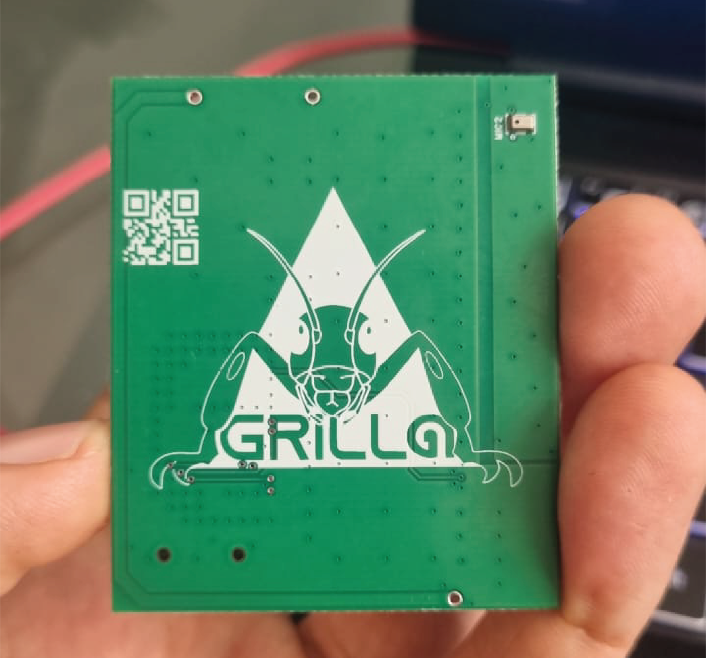
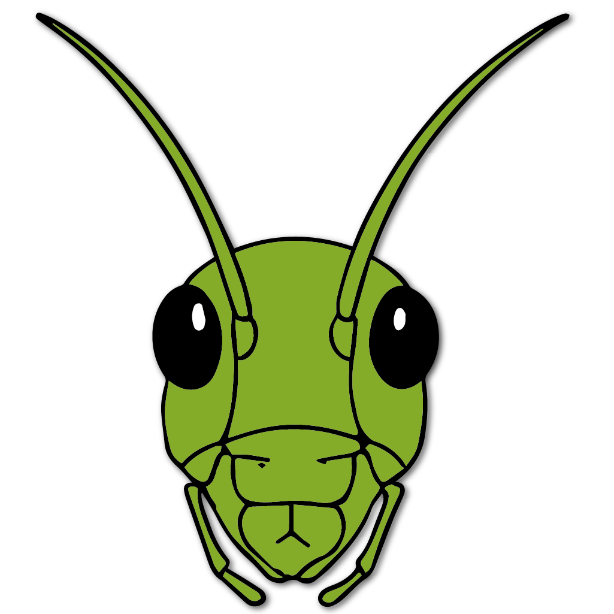

<html lang="es">
<head>
  <meta charset="UTF-8">
  <meta name="viewport" content="width=device-width, initial-scale=1">
  <title>Grilla</title>
  <link href="https://fonts.googleapis.com/css2?family=Montserrat:wght@400;700&display=swap" rel="stylesheet">
  
</head>
<body>
  

  <nav>
    <a href="#inicio">Grillos</a>
    <a href="#sobre">Firmware</a>
    <a href="#galeria">GrillApp</a>
    <a href="#contacto">Adquierelos</a>
  </nav>
  

    <section id="inicio">
      

        

          <h1>GRILLOS</h1>
          
Sensores acústicos pasivos de bajo costo diseñados para estudiar la biodiversidad a partir de la grabación de sonidos ambientales.

          

            <a href="#manual" class="buttons">Manual de operación</a>
            <a href="#ficha" class="buttons">Ficha técnica</a>
          

        

        

          
        

      

    </section>
    <section id="sobre">
      <h2>Firmware</h2>
      
Software para funcionamiento de los grillos. Descarga la version más reciente aquí: <a>v1.0.0</a>

      

            <a href="#manual" class="buttons">Manual de instalación</a>
      

    </section>
    <section id="galeria">
      

        

          <h2>GrillApp</h2>
          
Aplicacion android para configuración de dispositivos. Descargala en la <a>Playstore</a>.

        

        

          
        

      

    </section>
    <section id="contacto">
      <h2>Adquierelos</h2>
      
Contacta al equipo desarrollador para comprarlos o asistencia técnica escribiendo al número de <a href="https://wa.me/573182738651" style="color:#7be87b;font-weight:bold;text-decoration:none;font-size:1.13em;" target="_blank">WhatsApp: +57 318 2738651</a>

    </section>
  

</body>
</html>
