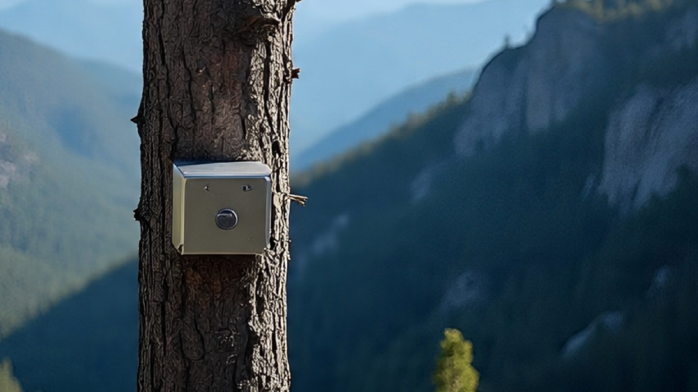

<html lang="es">
<head>
  <meta charset="UTF-8">
  <meta name="viewport" content="width=device-width, initial-scale=1">
  <title>Tecnología | Fundación Manacus</title>
  
</head>
<body>
  

  

    
    

      <h2>Tecnología para monitoreo de fauna</h2>
      
Herramientas tecnológicas acústicas diseñadas para el estudio de la biodiversidad.

    

  

    

  <a href="Grillos/" class="proyecto-title">Grillos</a>
      
Sensores acústicos pasivos para monitoreo de fauna

    

    <a href="../" class="back-btn">← Volver a la página anterior</a>
  

</body>
</html>
